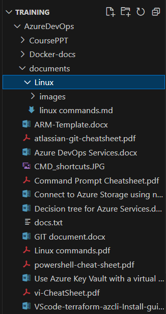

## ***Basic Commands***
### 1. File and directory operations commands

### 2. File Permission Commands
### 3. File Compression and Archiving Commands
### 4. Process Management Commands
### 5. System Information Commands
### 6. Networking Commands
### 7. IO Redirection Commands
### 8. Environment Variable Commands
### 9. User Management Commands
