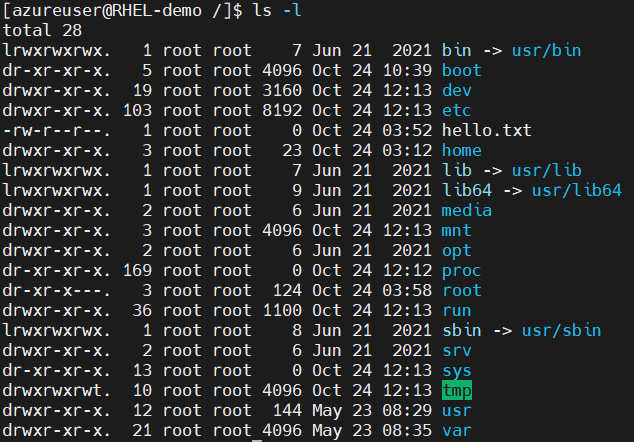
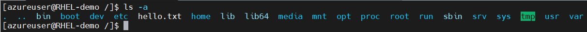
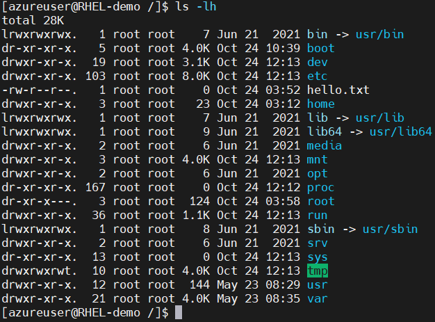
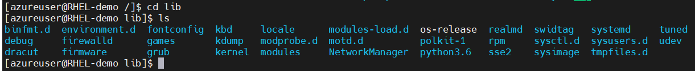
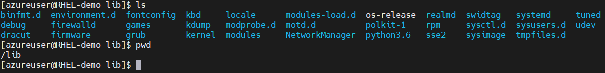

## ***Linux Basic Commands***
#### 1. File and directory operations commands


| Command     | Description | Example |
| :---        | :---:       |:---:     |
| [ls](https://www.geeksforgeeks.org/ls-command-in-linux/)          | List files and directories       |  <table>  <tbody>  <tr>  <td>ls -l</td><td>displays files and directories with detailed information</td>  <td></td>  </tr> <tr>  <td>ls -a</td> <td>shows all files and directories, including hidden</td> <td></td>  </tr> <tr>  <td>ls -lh</td> <td>displays file sizes in a human-readable format.</td> <td></td>  </tr></tbody>  </table>  |
| [cd](https://www.geeksforgeeks.org/cd-command-in-linux-with-examples/)   | Change Directory        | <table><tbody><tr>  <td>ls -l</td><td>changes the current directory to the specified path.</td>  <td></td>  </tr></table></tbody>        |
| [pwd](https://www.geeksforgeeks.org/pwd-command-in-linux-with-examples/)   | Print current working directory        | <table><tbody><tr>  <td>pwd</td><td>displays the current working directory</td>  <td></td>  </tr></table></tbody>        |
| Header      | Title       |  |


### 2. File Permission Commands
### 3. File Compression and Archiving Commands
### 4. Process Management Commands
### 5. System Information Commands
### 6. Networking Commands
### 7. IO Redirection Commands
### 8. Environment Variable Commands
### 9. User Management Commands

```image reference example```\
``````\
