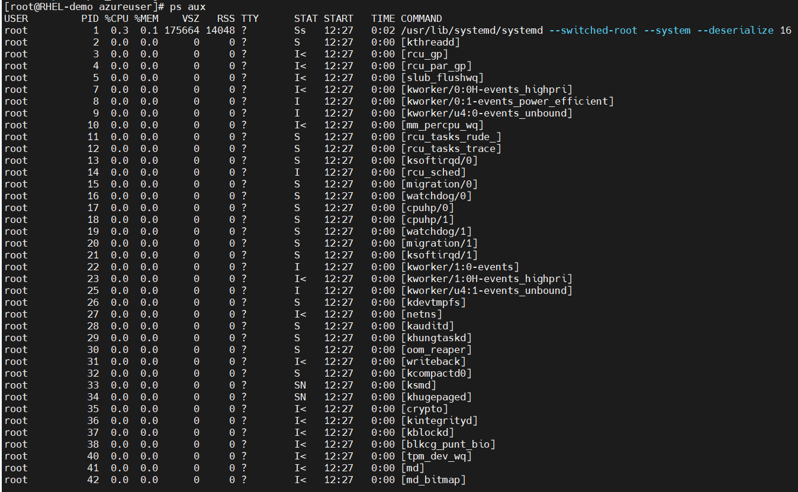
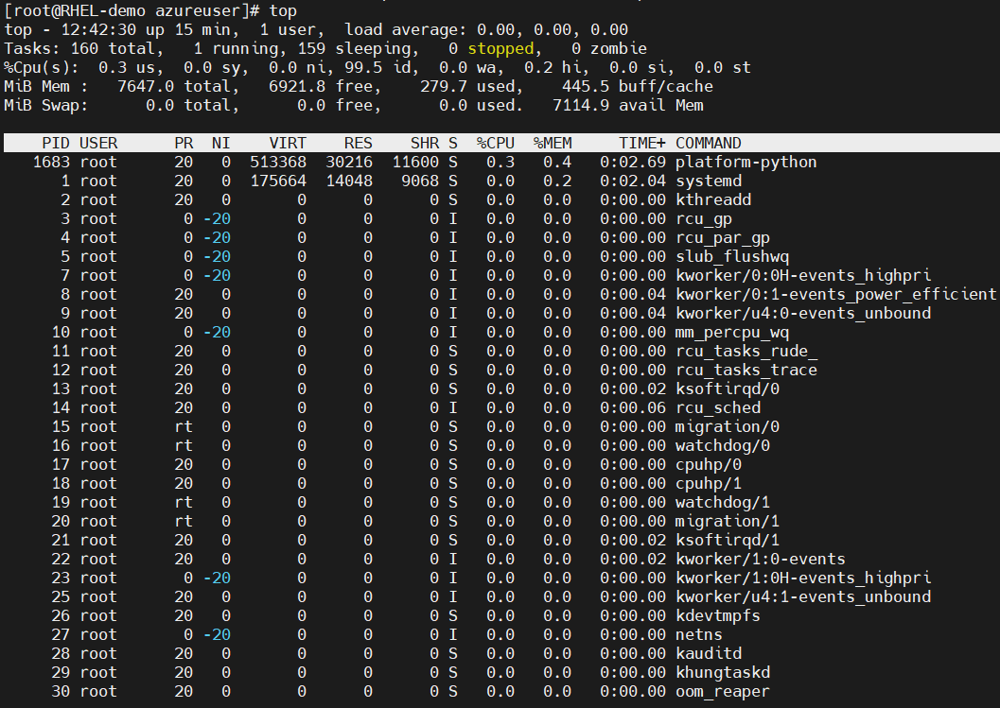
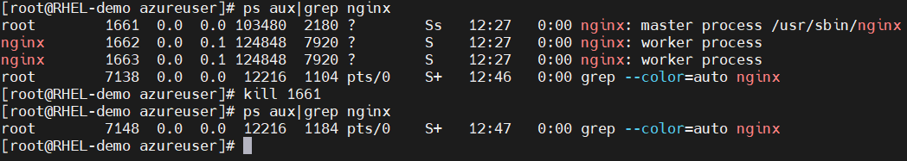
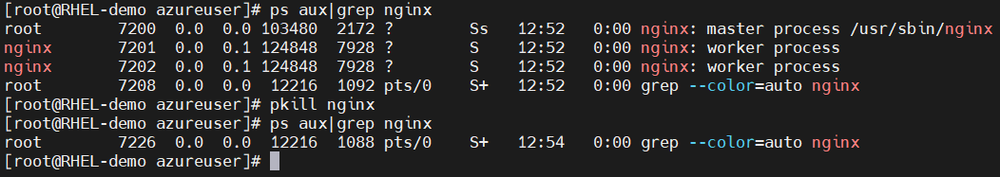
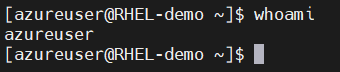
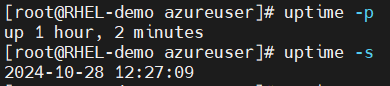
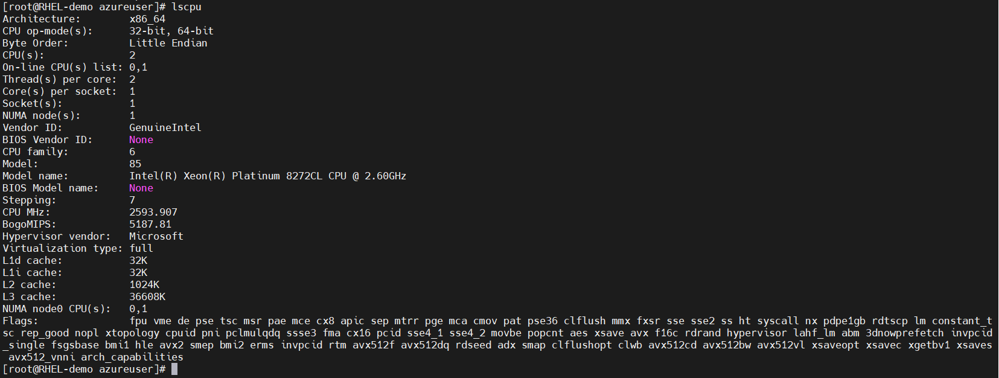
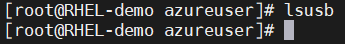

## ***Linux Basic Commands***
#### 1. File and directory operations commands

| Command     | Description | Example |
| :---        | :---       |:---    |
| [ls](https://www.geeksforgeeks.org/ls-command-in-linux/)          | List files and directories       |  <table>  <tbody>  <tr>  <td>ls -l</td><td>displays files and directories with detailed information</td>  <td></td>  </tr> <tr>  <td>ls -a</td> <td>shows all files and directories, including hidden</td> <td></td>  </tr> <tr>  <td>ls -lh</td> <td>displays file sizes in a human-readable format.</td> <td></td>  </tr></tbody>  </table>  |
| [cd](https://www.geeksforgeeks.org/cd-command-in-linux-with-examples/)   | Change Directory        | <table><tbody><tr>  <td>ls -l</td><td>changes the current directory to the specified path.</td>  <td></td>  </tr></table></tbody>        |
| [pwd](https://www.geeksforgeeks.org/pwd-command-in-linux-with-examples/)   | Print current working directory        | <table><tbody><tr>  <td>pwd</td><td>displays the current working directory</td>  <td></td>  </tr></tbody></table>       |
| [touch](https://www.geeksforgeeks.org/touch-command-in-linux-with-examples/)   | Create an empty file or update file timestamps.        | <table><tbody><tr>  <td>touch filename</td><td>creates an empty file named “file.txt”.</td>  <td></td>  </tr></tbody></table>       |
| [mkdir](https://www.geeksforgeeks.org/mkdir-command-in-linux-with-examples/)      | Create a new directory. | <table><tbody><tr>  <td>mkdir directoryname</td><td>creates a new directory named “my_directory”</td>  <td></td>  </tr></tbody></table> |
| [rm](https://www.geeksforgeeks.org/rm-command-linux-examples/)      | Remove files and directories.|<table>  <tbody>  <tr>  <td>rm filename</td><td>removing file</td>  <td></td>  </tr> <tr>  <td>rm -r</td> <td>deletes the directory “my_directory” and its contents.</td> <td></td>  </tr> <tr>  <td>rm -f filename</td> <td>forcefully deletes the file “file.txt” without confirmation</td> <td></td>  </tr></tbody>  </table>  |
| [cp](https://www.geeksforgeeks.org/cp-command-linux-examples/)      | Copy files and directories       |<table>  <tbody>  <tr>  <td>cp -r directory destination</td><td>copies the directory “directory” and its contents to the specified destination</td>  <td></td>  </tr> <tr>  <td>cp filename destination</td> <td>copies the file “file.txt” to the specified destination.</td> <td></td>  </tr> </tbody>  </table>  |
| [mv](https://www.geeksforgeeks.org/mv-command-linux-examples/)      | Move/rename files and directories.      |<table>  <tbody>  <tr>  <td>mv filename new_filename</td><td>renames the file “file.txt” to “new_name.txt”.</td>  <td></td>  </tr> <tr>  <td>mv filename destination</td> <td>moves the file “file.txt” to the specified directory.</td> <td></td>  </tr> </tbody>  </table>  |
| [cat](https://www.geeksforgeeks.org/cat-command-in-linux-with-examples/)      | View the contents of a file.       | <table>  <tbody>  <tr>  <td>cat file.txt</td><td>displays the contents of the file “file.txt”/ create a new file with file.txt if it not exists</td>  <td></td>  </tr> </tbody>  </table> |
| [head](https://www.geeksforgeeks.org/head-command-linux-examples/)      |  Display the first few lines of a file.      |<table>  <tbody>  <tr>  <td>head sample_file.log</td><td>shows the first 10 lines of the file “file.txt”</td>  <td></td>  </tr> <tr>  <td>head -n 5 sample_file.log</td><td>displays the first 5 lines of the file “file.txt”. You can specify number of lines to display. here i given 5.</td>  <td></td>  </tr></tbody>  </table>  |
| [tail](https://www.geeksforgeeks.org/tail-command-linux-examples/)      | Display the last few lines of a file      |<table>  <tbody>  <tr>  <td>tail sample_file.log</td><td>shows the last 10 lines of the file “file.txt”</td>  <td></td>  </tr> <tr>  <td>head -n 5 sample_file.log</td><td>displays the last 5 lines of the file “file.txt”. You can specify number of lines to display. here i given 5.</td>  <td></td>  </tr></tbody>  </table>  |
| [find](https://www.geeksforgeeks.org/find-command-in-linux-with-examples/)      | Search for files and directories.       |  <table>  <tbody>  <tr>  <td>find path/to/search "*.txt"</td><td>searches for all files with the extension “.txt” in the specified directory.In this example /home/azureuser given as path to search for txt files</td>  <td></td> </tr> </tbody>  </table> |
|      |      |   |

#### 2. File Permission Commands
> Note: Before start with the below commands refer the [Introduction to linux permissions](https://www.digitalocean.com/community/tutorials/an-introduction-to-linux-permissions)

| Command     | Description | Example |
| :---        | :---       |:---    |
| [chmod](https://www.geeksforgeeks.org/chmod-command-linux/)          | Change file permissions <ul><li>**u** : User/owner permissions.</li><li>**g** : Group permission</li><li>**o** : Other permissions</li><li>**+** : Add permissions</li><li>**-** : Remove permissions</li><li>**=** : Set permissions explicitly</li></ul>       |<table> <tbody> <tr>  <td>chmod u+rwx file1.txt</td> <td>grants read, write, and execute permissions to the owner of the file</td>   <td></td>  </tr></tbody> </table>    |
| [chown](https://www.geeksforgeeks.org/chown-command-in-linux-with-examples/)          | Change file ownership.       |<table><tbody><tr><td>chown user file1.txt</td><td>changes the owner of “file.txt” to the specified user.in this example file1.txt owner is root and i changed to azureuser</td>  <td></td> </tr> </tbody> </table> |
| [chgrp](https://www.geeksforgeeks.org/chgrp-command-in-linux-with-examples/)          |  Change group ownership.      |<table><tbody><tr><td>chown group file1.txt</td><td>changes the owner of “file.txt” to the specified group.in this example file1.txt group is root and i changed to azureuser</td>  <td></td> </tr> </tbody> </table> |

#### 3. File Compression and Archiving Commands
| Command     | Description | Example |
| :---        | :---       |:---    |
| [tar](https://www.geeksforgeeks.org/tar-command-linux-examples/)          | Create or extract archive files. <ul>**Options:**<li>**-c** : Create a new archive.</li><li>**-x** : Extract files from an archive.</li><li>**-f** : Specify the archive file name</li><li>**-v** : Verbose mode.</li><li>**-z** : Compress the archive with gzip.</li><li>**-j** : Compress the archive with bzip2</li></ul>       | <table><tbody><tr><td>tar -czvf sample.tar.gz sample_file.log</td><td>Creating the tar file in gz format of file,we can replace file name with directory name</td>  <td></td> </tr><tr><td>tar -xzvf sample.tar.gz </td><td>Goto the directory to where need to extract tar file and then run the exmaple command.</td>  <td></td></tr> </tbody> </table>   |
|[gzip](https://www.geeksforgeeks.org/gzip-command-linux/)|Compress the files. use **"-d"** to decompress the files |<table><tbody><tr><td>gzip sample_file.log</td><td>It will zip only files not directory to .gz format</td>  <td></td></tr> <tr><td>gzip -d sample_file.log.gz </td><td>unzipping the .gz files</td>  <td></td></tr> </tbody> </table>   |
|[zip](https://www.geeksforgeeks.org/zip-command-in-linux-with-examples/) & [unzip](https://www.howtogeek.com/414082/how-to-zip-or-unzip-files-from-the-linux-terminal/)|  Create compressed zip archives.We can use zip to multiple files in single zip file.Opttion **"-r"** will compress the recursively| <table><tbody><tr><td>zip archive.zip file1.txt file2.txt</td><td>We can zip the multiple files into single zip file</td>  <td></td></tr> <tr><td>unzip archive.zip </td><td>unzipping the .zip files use unzip command</td>  <td></td></tr> </tbody> </table>  |

#### 4. Process Management Commands
> In Linux, a **process** is a running instance of a program12. It consists of data read from files, input from a user, and program instructions. Processes can be either foreground (interactive) or background (non-interactive)

| Command     | Description | Example |
| :---        | :---       |:---    |
| [ps](https://www.geeksforgeeks.org/ps-command-in-linux-with-examples/)          |Display running processes.<ul>**Option**<li>**-aux** : Show all processes with detailed information.</li></ul> | <table><tbody><tr><td>ps aux</td><td>display all running processes with detailed information</td>  <td></td></tr></tbody> </table>   |
|  [top](https://www.geeksforgeeks.org/top-command-in-linux-with-examples/) |  Monitor system processes in real-time |<table><tbody><tr><td>top</td><td>displays a dynamic view of system processes and their resource usage</td>  <td></td></tr> </tbody> </table>|
|[kill](https://www.geeksforgeeks.org/kill-command-in-linux-with-examples/)   | Terminate a process.<ul>**Option**<li>**-9** :Forcefully kill a process.  | <table><tbody><tr><td>kill PID</td><td>terminates the process with the specified process ID.</td>  <td></td></tr> </tbody> </table>  |
|  [pkill](https://www.geeksforgeeks.org/kill-command-in-linux-with-examples/) |Terminate processes based on their name.   | <table><tbody><tr><td>pkill Process_name</td><td>terminates all the process with the specified process name.</td>  <td></td></tr> </tbody> </table>  |

#### 5. System Information Commands
| Command     | Description | Example |
| :---        | :---       |:---    |
| [uname](https://www.geeksforgeeks.org/uname-command-in-linux-with-examples/)          |Print system information <ul>**Option**<li>**-a** : All system information.</li></ul> | <table><tbody><tr><td>uname -a</td><td>displays all system information. look at the screenshot for without option</td>  <td></td></tr></tbody> </table>   |
| [whoami](https://www.geeksforgeeks.org/whoami-command-linux-example/)          |Display current username. | <table><tbody><tr><td>whoami</td><td>shows the current username</td>  <td></td></tr></tbody> </table>   |
|[df](https://www.geeksforgeeks.org/df-command-in-linux-with-examples/) | Show disk space usage<ul>**Option**<li>**-h**: Human readable sizes</li>  | <table><tbody><tr><td>df -h</td><td>displays disk space usage in a human-readable format.look at the screenshot without -h option</td>  <td></td></tr> </tbody> </table>  |
|[du](https://www.geeksforgeeks.org/du-command-linux-examples/)   |Estimate file and directory sizes.<ul>**Option**<li>**-h** : Humanreadable sizes</li><li>**-s** : Display total size only.</li>   | <table><tbody><tr><td>du -sh <directory_name> du -sh  /home/azureuser</td><td>provides the total size of the specified directory.</td>  <td></td></tr> </tbody> </table>  |
|[free](https://www.geeksforgeeks.org/free-command-linux-examples/)   |Display memory usage information.<ul>**Option**<li>**-h**: Human readable sizes </li>  | <table><tbody><tr><td>free -h</td><td>displays memory usage in a human-readable format.</td>  <td></td></tr> </tbody> </table>  |
|[uptime](https://www.geeksforgeeks.org/linux-uptime-command-with-examples/)   |  Shows system Uptime means for howlong it is in Powered ON state<ul>**Option**<li>**-p** : Show uptime in pretty format</li><li>**-s** : System up since | <table><tbody><tr><td>uptime</td><td>shows the current system uptime.look at the screenshot of results for different options </td>  <td></td></tr> </tbody> </table>  |
|lscpu   |Display CPU Information |<table><tbody><tr><td>lscpu</td><td>Provides detailed CPU information </td>  <td></td></tr> </tbody> </table>   |
|[lsusb](https://www.geeksforgeeks.org/lsusb-command-in-linux-with-examples/)   |Display usb device Information |<table><tbody><tr><td>lsusb</td><td>lists all connected USB devices. here no USB devices connected</td>  <td></td></tr> </tbody> </table>   |
#### 6. Networking Commands
#### 7. IO Redirection Commands
#### 8. Environment Variable Commands
#### 9. User Management Commands