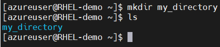
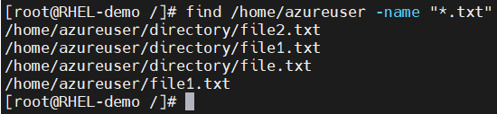

## ***Linux Basic Commands***
#### 1. File and directory operations commands

| Command     | Description | Example |
| :---        | :---       |:---    |
| [ls](https://www.geeksforgeeks.org/ls-command-in-linux/)          | List files and directories       |  <table>  <tbody>  <tr>  <td>ls -l</td><td>displays files and directories with detailed information</td>  <td></td>  </tr> <tr>  <td>ls -a</td> <td>shows all files and directories, including hidden</td> <td></td>  </tr> <tr>  <td>ls -lh</td> <td>displays file sizes in a human-readable format.</td> <td></td>  </tr></tbody>  </table>  |
| [cd](https://www.geeksforgeeks.org/cd-command-in-linux-with-examples/)   | Change Directory        | <table><tbody><tr>  <td>ls -l</td><td>changes the current directory to the specified path.</td>  <td></td>  </tr></table></tbody>        |
| [pwd](https://www.geeksforgeeks.org/pwd-command-in-linux-with-examples/)   | Print current working directory        | <table><tbody><tr>  <td>pwd</td><td>displays the current working directory</td>  <td></td>  </tr></tbody></table>       |
| [touch](https://www.geeksforgeeks.org/touch-command-in-linux-with-examples/)   | Create an empty file or update file timestamps.        | <table><tbody><tr>  <td>touch filename</td><td>creates an empty file named “file.txt”.</td>  <td></td>  </tr></tbody></table>       |
| [mkdir](https://www.geeksforgeeks.org/mkdir-command-in-linux-with-examples/)      | Create a new directory. | <table><tbody><tr>  <td>mkdir directoryname</td><td>creates a new directory named “my_directory”</td>  <td></td>  </tr></tbody></table> |
| [rm](https://www.geeksforgeeks.org/rm-command-linux-examples/)      | Remove files and directories.|<table>  <tbody>  <tr>  <td>rm filename</td><td>removing file</td>  <td></td>  </tr> <tr>  <td>rm -r</td> <td>deletes the directory “my_directory” and its contents.</td> <td></td>  </tr> <tr>  <td>rm -f filename</td> <td>forcefully deletes the file “file.txt” without confirmation</td> <td></td>  </tr></tbody>  </table>  |
| [cp](https://www.geeksforgeeks.org/cp-command-linux-examples/)      | Copy files and directories       |<table>  <tbody>  <tr>  <td>cp -r directory destination</td><td>copies the directory “directory” and its contents to the specified destination</td>  <td></td>  </tr> <tr>  <td>cp filename destination</td> <td>copies the file “file.txt” to the specified destination.</td> <td></td>  </tr> </tbody>  </table>  |
| [mv](https://www.geeksforgeeks.org/mv-command-linux-examples/)      | Move/rename files and directories.      |<table>  <tbody>  <tr>  <td>mv filename new_filename</td><td>renames the file “file.txt” to “new_name.txt”.</td>  <td></td>  </tr> <tr>  <td>mv filename destination</td> <td>moves the file “file.txt” to the specified directory.</td> <td></td>  </tr> </tbody>  </table>  |
| [cat](https://www.geeksforgeeks.org/cat-command-in-linux-with-examples/)      | View the contents of a file.       | <table>  <tbody>  <tr>  <td>cat file.txt</td><td>displays the contents of the file “file.txt”/ create a new file with file.txt if it not exists</td>  <td></td>  </tr> </tbody>  </table> |
| [head](https://www.geeksforgeeks.org/head-command-linux-examples/)      |  Display the first few lines of a file.      |<table>  <tbody>  <tr>  <td>head sample_file.log</td><td>shows the first 10 lines of the file “file.txt”</td>  <td></td>  </tr> <tr>  <td>head -n 5 sample_file.log</td><td>displays the first 5 lines of the file “file.txt”. You can specify number of lines to display. here i given 5.</td>  <td></td>  </tr></tbody>  </table>  |
| [tail](https://www.geeksforgeeks.org/tail-command-linux-examples/)      | Display the last few lines of a file      |<table>  <tbody>  <tr>  <td>tail sample_file.log</td><td>shows the last 10 lines of the file “file.txt”</td>  <td></td>  </tr> <tr>  <td>head -n 5 sample_file.log</td><td>displays the last 5 lines of the file “file.txt”. You can specify number of lines to display. here i given 5.</td>  <td></td>  </tr></tbody>  </table>  |
| [find](https://www.geeksforgeeks.org/find-command-in-linux-with-examples/)      | Search for files and directories.       |  <table>  <tbody>  <tr>  <td>find path/to/search "*.txt"</td><td>searches for all files with the extension “.txt” in the specified directory.In this example /home/azureuser given as path to search for txt files</td>  <td></td> </tr> </tbody>  </table> |
|      |      |   |

#### 2. File Permission Commands
> Note: Before start with the below commands refer the [Introduction to linux permissions](https://www.digitalocean.com/community/tutorials/an-introduction-to-linux-permissions)

| Command     | Description | Example |
| :---        | :---       |:---    |
| [chmod](https://www.geeksforgeeks.org/chmod-command-linux/)          | Change file permissions <ul><li>**u** : User/owner permissions.</li><li>**g** : Group permission</li><li>**o** : Other permissions</li><li>**+** : Add permissions</li><li>**-** : Remove permissions</li><li>**=** : Set permissions explicitly</li></ul>       |<table> <tbody> <tr>  <td>chmod u+rwx file1.txt</td> <td>grants read, write, and execute permissions to the owner of the file</td>   <td></td>  </tr></tbody> </table>    |
| [chown](https://www.geeksforgeeks.org/chown-command-in-linux-with-examples/)          | Change file ownership.       |<table><tbody><tr><td>chown user file1.txt</td><td>changes the owner of “file.txt” to the specified user.in this example file1.txt owner is root and i changed to azureuser</td>  <td></td> </tr> </tbody> </table> |
| [chgrp](https://www.geeksforgeeks.org/chgrp-command-in-linux-with-examples/)          |  Change group ownership.      |<table><tbody><tr><td>chown group file1.txt</td><td>changes the owner of “file.txt” to the specified group.in this example file1.txt group is root and i changed to azureuser</td>  <td></td> </tr> </tbody> </table> |

### 3. File Compression and Archiving Commands
### 4. Process Management Commands
### 5. System Information Commands
### 6. Networking Commands
### 7. IO Redirection Commands
### 8. Environment Variable Commands
### 9. User Management Commands